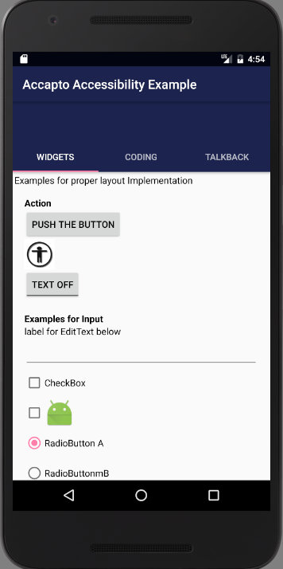
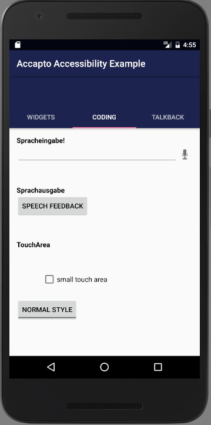
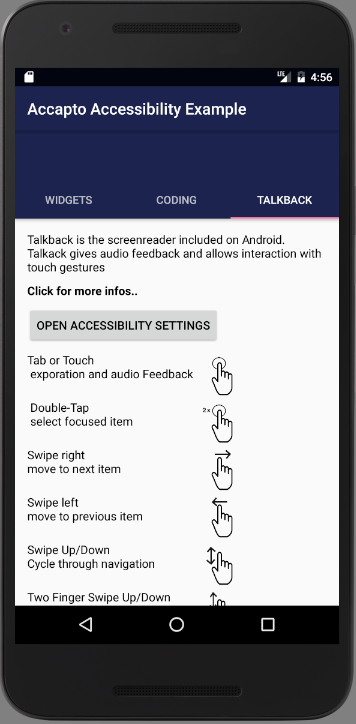

# AccaptoAccessibilityExample
Example for Accessibility in Android

This project shows some example to implement accessible Android apps. Some ideas are inspired form this project https://github.com/googlesamples/android-BasicAccessibility.

Features
--------

The first part shows some examples for xml based widgets and their proper implementation like proper usage of alternative texts(contentdescription)

The second part shows 4 code based extension to improve the accessibility

- Speech-to-Text Input: adding speech input to a custom field in the app
- Text-to-speech Output: self-voicing (without TalkBack) within the app
- TouchAreaExtension: extending the touch area of a small icon at runtime
- ThemeChanger: change the app theme to another one with for example larger fonts and more color contrast at runtime

The last part is a shor tutorial for the usage of android#s screenreader Talkbak

Links
-----
Useful links for further development are:

 - https://material.io/guidelines/usability/accessibility.html
 - https://developer.android.com/guide/topics/ui/accessibility/apps.html

This project is part of my Phd thesis on model-driven development for accessible mobile apps.

Contact:
--------
This project is part of my Phd thesis on model-driven development for accessible mobile apps.

Elmar Krainz
elmar.krainz@fh-joanneum.at

